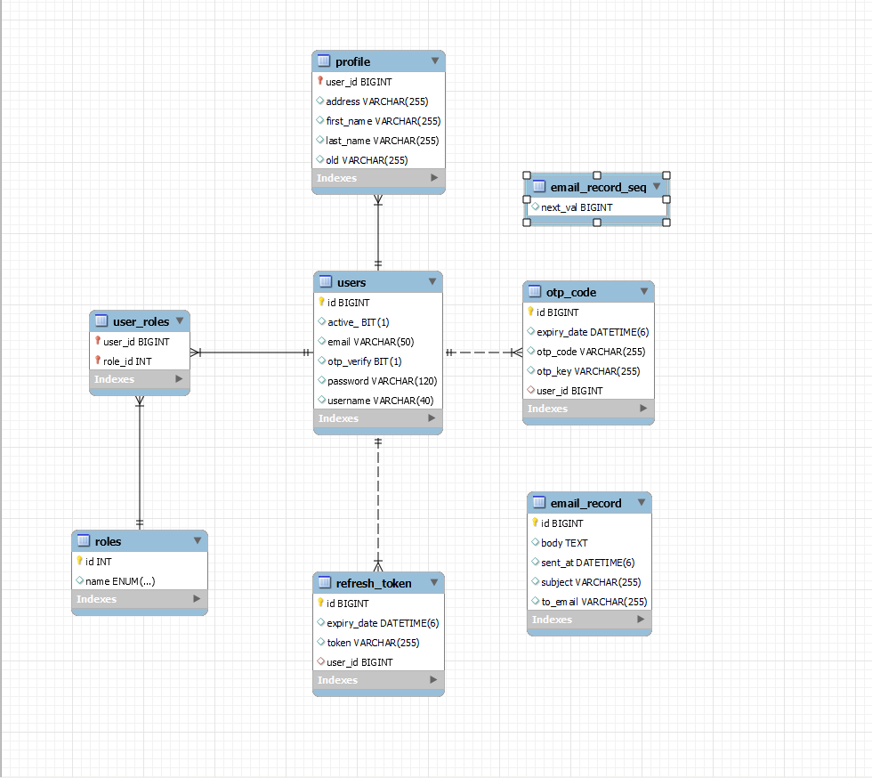

# Overview 

Api:
 - signin
 - signup
 - forgot-password
 - otp
 - resend-otp
 - profile
 - update-profile

### DB:


### Library

```pom
	<parent>
		<groupId>org.springframework.boot</groupId>
		<artifactId>spring-boot-starter-parent</artifactId>
		<version>3.3.12</version>
		<relativePath/> <!-- lookup parent from repository -->
	</parent>
    <properties>
            <java.version>17</java.version>
            <lombok.version>1.18.30</lombok.version>
        </properties>
    <dependencies>
            <dependency>
                <groupId>org.springframework.boot</groupId>
                <artifactId>spring-boot-starter-web</artifactId>
            </dependency>
            <dependency>
                <groupId>org.springframework.boot</groupId>
                <artifactId>spring-boot-starter-data-jpa</artifactId>
            </dependency>
            <dependency>
                <groupId>org.springframework.boot</groupId>
                <artifactId>spring-boot-starter-security</artifactId>
            </dependency>
    
            <dependency>
                <groupId>org.springframework.boot</groupId>
                <artifactId>spring-boot-devtools</artifactId>
                <scope>runtime</scope>
                <optional>true</optional>
            </dependency>
            <dependency>
                <groupId>com.mysql</groupId>
                <artifactId>mysql-connector-j</artifactId>
                <scope>runtime</scope>
            </dependency>
            <dependency>
                <groupId>org.projectlombok</groupId>
                <artifactId>lombok</artifactId>
                <optional>true</optional>
                <version>${lombok.version}</version>
            </dependency>
            <dependency>
                <groupId>org.springframework.boot</groupId>
                <artifactId>spring-boot-starter-test</artifactId>
                <scope>test</scope>
            </dependency>
            <dependency>
                <groupId>org.springframework.security</groupId>
                <artifactId>spring-security-test</artifactId>
                <scope>test</scope>
            </dependency>
    
            <dependency>
                <groupId>org.springframework.boot</groupId>
                <artifactId>spring-boot-starter-mail</artifactId>
            </dependency>
        </dependencies>
    
        <build>
            <plugins>
                <plugin>
                    <groupId>org.apache.maven.plugins</groupId>
                    <artifactId>maven-compiler-plugin</artifactId>
                    <configuration>
                        <annotationProcessorPaths>
                            <path>
                                <groupId>org.projectlombok</groupId>
                                <artifactId>lombok</artifactId>
                                <version>${lombok.version}</version>
                            </path>
                        </annotationProcessorPaths>
                    </configuration>
                </plugin>
                <plugin>
                    <groupId>org.springframework.boot</groupId>
                    <artifactId>spring-boot-maven-plugin</artifactId>
                    <configuration>
                        <excludes>
                            <exclude>
                                <groupId>org.projectlombok</groupId>
                                <artifactId>lombok</artifactId>
                            </exclude>
                        </excludes>
                    </configuration>
                </plugin>
            </plugins>
        </build>
```
#
### Create [UserRepository.java](src%2Fmain%2Fjava%2Fcom%2Fexample%2Fsecurity%2Frepositories%2FUserRepository.java)
```java
import com.example.security.model.entity.User;
import org.springframework.data.jpa.repository.JpaRepository;
import org.springframework.stereotype.Repository;

import java.util.Optional;

@Repository
public interface UserRepository extends JpaRepository<User, Long> {
  Optional<User> findByUsername(String username);
  Optional<User> findByUsernameAndActiveIsAndOtpVerifyIs(String username, boolean active, boolean acceptIs);

  Boolean existsByUsername(String username);

  Boolean existsByEmail(String email);
}
```
#
### Create [ResourceException.java](src%2Fmain%2Fjava%2Fcom%2Fexample%2Fsecurity%2Fexception%2FResourceException.java)
```java
public class ResourceException extends RuntimeException {
    private Object error;

    public ResourceException(String message) {
        super(message);
    }

    public ResourceException(String message, Object error) {
        super(message);
        this.error = error;
    }
}
```

#
### Create [UserDetailsImpl.java](src%2Fmain%2Fjava%2Fcom%2Fexample%2Fsecurity%2Fservice%2Fuser%2FUserDetailsImpl.java)
```java
import com.example.security.model.entity.User;
import com.fasterxml.jackson.annotation.JsonIgnore;
import org.springframework.security.core.GrantedAuthority;
import org.springframework.security.core.authority.SimpleGrantedAuthority;
import org.springframework.security.core.userdetails.UserDetails;
import org.springframework.stereotype.Service;

import java.util.Collection;
import java.util.List;
import java.util.Objects;
import java.util.stream.Collectors;

/**
 Object of  user detail
 * */
@Service
public class UserDetailsImpl implements UserDetails {
  private static final long serialVersionUID = 1L;

  private Long id;

  private String username;

  private String email;

  @JsonIgnore
  private String password;

  private Collection<? extends GrantedAuthority> authorities;

  public UserDetailsImpl(Long id, String username, String email, String password,
                         Collection<? extends GrantedAuthority> authorities) {
    this.id = id;
    this.username = username;
    this.email = email;
    this.password = password;
    this.authorities = authorities;
  }
  public UserDetailsImpl() {

  }

  /**
   method to build UserDetail (called user detailsService Impl for return UserDetail)
   */
  public UserDetailsImpl build(User user) {
    List<GrantedAuthority> authorities = user.getRoles().stream()
        .map(role -> new SimpleGrantedAuthority(role.getName().name()))
        .collect(Collectors.toList());

    return new UserDetailsImpl(
        user.getId(), 
        user.getUsername(), 
        user.getEmail(),
        user.getPassword(), 
        authorities
    );
  }

  @Override
  public Collection<? extends GrantedAuthority> getAuthorities() {
    return authorities;
  }

  public Long getId() {
    return id;
  }

  public String getEmail() {
    return email;
  }

  @Override
  public String getPassword() {
    return password;
  }

  @Override
  public String getUsername() {
    return username;
  }

  @Override
  public boolean isAccountNonExpired() {
    return true;
  }

  @Override
  public boolean isAccountNonLocked() {
    return true;
  }

  @Override
  public boolean isCredentialsNonExpired() {
    return true;
  }

  @Override
  public boolean isEnabled() {
    return true;
  }

  @Override
  public boolean equals(Object o) {
    if (this == o)
      return true;
    if (o == null || getClass() != o.getClass())
      return false;
    UserDetailsImpl user = (UserDetailsImpl) o;
    return Objects.equals(id, user.id);
  }
}
```
#
### Create [UserDetailsServiceImpl.java](src%2Fmain%2Fjava%2Fcom%2Fexample%2Fsecurity%2Fservice%2Fuser%2FUserDetailsServiceImpl.java)
```java
import com.example.security.exception.ResourceException;
import com.example.security.model.entity.User;
import com.example.security.repositories.UserRepository;
import org.springframework.beans.factory.annotation.Autowired;
import org.springframework.security.core.userdetails.UserDetails;
import org.springframework.security.core.userdetails.UserDetailsService;
import org.springframework.security.core.userdetails.UsernameNotFoundException;
import org.springframework.stereotype.Service;
import org.springframework.transaction.annotation.Transactional;

/**
 * interface has a method to load
 * User by username and returns a UserDetails object that Spring Security can use for authentication and validation
 *
 * @return load user and Return userDetail to authentication and validation
 */
@Service
public class UserDetailsServiceImpl implements UserDetailsService {
    @Autowired
    private UserRepository userRepository;

    @Autowired
    private UserDetailsImpl userDetails;

    public static final String USER_NOT_FOUND = "Username not found ";

    @Override
    @Transactional
    public UserDetails loadUserByUsername(String username) throws UsernameNotFoundException {
        User user = userRepository.findByUsernameAndActiveIsAndOtpVerifyIs(username, true, true)
                .orElseThrow(() -> new ResourceException(USER_NOT_FOUND));

        return userDetails.build(user);
    }
}
```

#
### add Jwt library
```pom
<dependency>
    <groupId>io.jsonwebtoken</groupId>
    <artifactId>jjwt</artifactId>
    <version>0.9.1</version>
</dependency>
```

#
### Create [JwtUtils.java](src%2Fmain%2Fjava%2Fcom%2Fexample%2Fsecurity%2Futils%2FJwtUtils.java) 
```java
import com.example.security.service.user.UserDetailsImpl;
import io.jsonwebtoken.*;
import org.slf4j.Logger;
import org.slf4j.LoggerFactory;
import org.springframework.beans.factory.annotation.Value;
import org.springframework.security.core.Authentication;
import org.springframework.stereotype.Component;

import java.util.Date;

@Component
public class JwtUtils {
  private static final Logger logger = LoggerFactory.getLogger(JwtUtils.class);

  @Value("${bezkoder.app.jwtSecret}")
  private String jwtSecret;

  @Value("${bezkoder.app.jwtExpirationMs}")
  private int jwtExpirationMs;


  public String generateAccessToken(Authentication authentication) {

    UserDetailsImpl userPrincipal = (UserDetailsImpl) authentication.getPrincipal();

    return Jwts.builder()
        .setSubject((userPrincipal.getUsername()))
        .setIssuedAt(new Date())
        .setExpiration(new Date((new Date()).getTime() + jwtExpirationMs))
        .signWith(SignatureAlgorithm.HS512, jwtSecret)
        .compact();
  }

  public String generateAccessToken(String username) {
    return Jwts.builder()
            .setSubject((username))
            .setIssuedAt(new Date())
            .setExpiration(new Date((new Date()).getTime() + jwtExpirationMs))
            .signWith(SignatureAlgorithm.HS512, jwtSecret)
            .compact();
  }

  /**
   get username and password from body of JWT
   * */
  public String getUserNameFromJwtToken(String token) {
    return Jwts.parser().setSigningKey(jwtSecret).parseClaimsJws(token).getBody().getSubject();
  }

  public boolean validateJwtToken(String authToken) {
    try {
      Jwts.parser().setSigningKey(jwtSecret).parseClaimsJws(authToken);
      return true;
    } catch (SignatureException e) {
      logger.error("Invalid JWT signature: {}", e.getMessage());
    } catch (MalformedJwtException e) {
      logger.error("Invalid JWT token: {}", e.getMessage());
    } catch (ExpiredJwtException e) {
      logger.error("JWT token is expired: {}", e.getMessage());
    } catch (UnsupportedJwtException e) {
      logger.error("JWT token is unsupported: {}", e.getMessage());
    } catch (IllegalArgumentException e) {
      logger.error("JWT claims string is empty: {}", e.getMessage());
    }
    return false;
  }
  public String getUsernameFromToken(String token) {
    return Jwts.parser().setSigningKey(jwtSecret)
            .parseClaimsJws(token)
            .getBody().getSubject();
  }

}
```

#
### Create [AuthTokenFilter.java](src%2Fmain%2Fjava%2Fcom%2Fexample%2Fsecurity%2Fconfig%2FAuthTokenFilter.java)
- check after login
```java
import com.example.security.service.user.UserDetailsServiceImpl;
import com.example.security.utils.JwtUtils;
import jakarta.servlet.FilterChain;
import jakarta.servlet.ServletException;
import jakarta.servlet.http.HttpServletRequest;
import jakarta.servlet.http.HttpServletResponse;
import org.slf4j.Logger;
import org.slf4j.LoggerFactory;
import org.springframework.beans.factory.annotation.Autowired;
import org.springframework.security.authentication.UsernamePasswordAuthenticationToken;
import org.springframework.security.core.context.SecurityContextHolder;
import org.springframework.security.core.userdetails.UserDetails;
import org.springframework.security.web.authentication.WebAuthenticationDetailsSource;
import org.springframework.util.StringUtils;
import org.springframework.web.filter.OncePerRequestFilter;

import java.io.IOException;

/**
 * Check JWT token
 * – OncePerRequestFilter makes a single execution for each request to our API.
 * It provides a doFilterInternal() method that we will implement parsing & validating JWT,
 * loading User details (using UserDetailsService), checking Authorizaion (using UsernamePasswordAuthenticationToken).
 * */
public class AuthTokenFilter extends OncePerRequestFilter {
  @Autowired
  private JwtUtils jwtUtils;

  @Autowired
  private UserDetailsServiceImpl userDetailsService;

  private static final Logger logger = LoggerFactory.getLogger(AuthTokenFilter.class);

  @Override
  protected void doFilterInternal(HttpServletRequest request, HttpServletResponse response, FilterChain filterChain)
      throws ServletException, IOException {
    try {
      String jwt = parseJwt(request);
      if (jwt != null && jwtUtils.validateJwtToken(jwt)) {// check validate for token
        String username = jwtUtils.getUserNameFromJwtToken(jwt);

        UserDetails userDetails = userDetailsService.loadUserByUsername(username);

        // get username password from Login request
        UsernamePasswordAuthenticationToken authentication =
            new UsernamePasswordAuthenticationToken(
                userDetails,
                null,
                userDetails.getAuthorities());
        authentication.setDetails(new WebAuthenticationDetailsSource().buildDetails(request));

        // provide the permission access to access in to Security context
        SecurityContextHolder.getContext().setAuthentication(authentication);
      }
    } catch (Exception e) {
      logger.error("Cannot set user authentication: ", e);
    }

    filterChain.doFilter(request, response);
  }

  private String parseJwt(HttpServletRequest request) {
    String headerAuth = request.getHeader("Authorization");

    if (StringUtils.hasText(headerAuth) && headerAuth.startsWith("Bearer ")) {
      return headerAuth.substring(7, headerAuth.length());
    }

    return null;
  }
}

```

#
### Create [LoginRequest.java](src%2Fmain%2Fjava%2Fcom%2Fexample%2Fsecurity%2Fmodel%2Frequest%2FLoginRequest.java)
```java
import lombok.AllArgsConstructor;
import lombok.Builder;
import lombok.Getter;
import lombok.NoArgsConstructor;
import lombok.Setter;


@AllArgsConstructor
@NoArgsConstructor
@Setter
@Getter
@Builder
public class LoginRequest {
    @NotBlank
    private String username;

    @NotBlank
    private String password;
}
```

#
### Create [JwtResponse.java](src%2Fmain%2Fjava%2Fcom%2Fexample%2Fsecurity%2Fmodel%2Fresponse%2FJwtResponse.java)
```java
import lombok.AllArgsConstructor;
import lombok.Getter;
import lombok.NoArgsConstructor;
import lombok.Setter;

import java.util.List;

@Getter
@Setter
@AllArgsConstructor
@NoArgsConstructor
public class JwtResponse {
    private String token;
    private String refreshToken;
    private String type = "Bearer";
    private Long id;
    private String username;
    private String email;
    private List<String> roles;

    public JwtResponse(String accessToken, String refreshToken, Long id, String username, String email, List<String> roles) {
        this.token = accessToken;
        this.refreshToken = refreshToken;
        this.id = id;
        this.username = username;
        this.email = email;
        this.roles = roles;
    }

}
```

#
### Create [ProfileRepository.java](src%2Fmain%2Fjava%2Fcom%2Fexample%2Fsecurity%2Frepositories%2FProfileRepository.java)
```java
import com.example.security.model.entity.Profile;
import com.example.security.model.entity.User;
import org.springframework.data.jpa.repository.JpaRepository;

import java.util.Optional;

public interface ProfileRepository extends JpaRepository<Profile, User> {
    Optional<Profile> findById(Long userId);
}
```
#
### Create [RefreshTokenRepository.java](src%2Fmain%2Fjava%2Fcom%2Fexample%2Fsecurity%2Frepositories%2FRefreshTokenRepository.java)
```java
import com.example.security.model.entity.RefreshToken;
import org.springframework.data.jpa.repository.JpaRepository;
import org.springframework.stereotype.Repository;
import org.springframework.transaction.annotation.Transactional;

import java.time.Instant;
import java.util.Optional;

@Repository
public interface RefreshTokenRepository extends JpaRepository<RefreshToken, Long> {

    Optional<RefreshToken> findByToken(String token);
    void deleteByUserId(Long userId);

    @Transactional
    int deleteByExpiryDateBefore(Instant now);
}
```

#
### Create [RoleRepository.java](src%2Fmain%2Fjava%2Fcom%2Fexample%2Fsecurity%2Frepositories%2FRoleRepository.java)
```java
import com.example.security.model.entity.Role;
import com.example.security.model.role_enum.ERole;
import org.springframework.data.jpa.repository.JpaRepository;
import org.springframework.stereotype.Repository;

import java.util.Optional;

@Repository
public interface RoleRepository extends JpaRepository<Role, Integer> {
  Optional<Role> findByName(ERole name);
}
```

#
### Create [JwtRefreshResponse.java](src%2Fmain%2Fjava%2Fcom%2Fexample%2Fsecurity%2Fmodel%2Fresponse%2FJwtRefreshResponse.java)
```java
import lombok.AllArgsConstructor;
import lombok.Getter;
import lombok.NoArgsConstructor;
import lombok.Setter;

@Getter
@Setter
@AllArgsConstructor
@NoArgsConstructor
public class JwtRefreshResponse {
    private String token;
    private String type = "Bearer";
    private String refreshToken;
    private String username;


    public JwtRefreshResponse(String token, String refreshToken, String username) {
        this.token = token;
        this.refreshToken = refreshToken;
        this.username = username;
    }
}
```

#
### Create [TokenRefreshRequest.java](src%2Fmain%2Fjava%2Fcom%2Fexample%2Fsecurity%2Fmodel%2Frequest%2FTokenRefreshRequest.java)
```java
import com.fasterxml.jackson.annotation.JsonProperty;
import lombok.Builder;
import lombok.Data;

@Data
@Builder
public class TokenRefreshRequest {
    @JsonProperty("refresh_token")
    private String refreshToken;
    private String username;
}
```

#
### Create [RefreshTokenService.java](src%2Fmain%2Fjava%2Fcom%2Fexample%2Fsecurity%2Fservice%2FRefreshTokenService.java)
```java
import com.example.security.model.entity.RefreshToken;
import com.example.security.model.entity.User;
import com.example.security.model.request.TokenRefreshRequest;
import com.example.security.model.response.JwtRefreshResponse;
import com.example.security.repositories.RefreshTokenRepository;
import com.example.security.repositories.UserRepository;
import com.example.security.service.user.UserDetailsImpl;
import com.example.security.utils.JwtUtils;
import org.springframework.beans.factory.annotation.Autowired;
import org.springframework.beans.factory.annotation.Value;
import org.springframework.http.ResponseEntity;
import org.springframework.scheduling.annotation.Scheduled;
import org.springframework.security.core.Authentication;
import org.springframework.stereotype.Service;

import java.time.Instant;
import java.util.UUID;

@Service
public class RefreshTokenService {

    @Autowired
    private JwtUtils jwtUtils;

    @Autowired
    private UserRepository userRepository;

    @Autowired
    private RefreshTokenRepository refreshTokenRepository;

    @Value("${jwt.refresh.expirationMs}")
    private Long refreshTokenDurationMs;

    public RefreshToken createRefreshToken(Authentication authentication) {
        UserDetailsImpl userPrincipal = (UserDetailsImpl) authentication.getPrincipal();

        User user = userRepository.findByUsername(userPrincipal.getUsername())
                .orElseThrow(() -> new RuntimeException("User not found"));

        // Delete old token (optional)
        refreshTokenRepository.deleteByUserId(user.getId());

        RefreshToken refreshToken = new RefreshToken();
        refreshToken.setId(user.getId());
        refreshToken.setUser(user);
        refreshToken.setExpiryDate(Instant.now().plusMillis(refreshTokenDurationMs));
        refreshToken.setToken(UUID.randomUUID().toString());

        return refreshTokenRepository.save(refreshToken);
    }

    public RefreshToken verifyExpiration(RefreshToken token) {
        if (token.isExpired()) {
            refreshTokenRepository.delete(token);
            throw new RuntimeException("Refresh token expired");
        }
        return token;
    }

    public ResponseEntity<JwtRefreshResponse> refreshToken(TokenRefreshRequest request) {
        String requestToken = request.getRefreshToken();

        return refreshTokenRepository.findByToken(requestToken)
                .map(this::verifyExpiration)
                .map(RefreshToken::getUser)
                .map(user -> {
                    String accessToken = jwtUtils.generateAccessToken(user.getUsername());
                    return ResponseEntity.ok(new JwtRefreshResponse(accessToken, request.getRefreshToken(), user.getUsername()));
                })
                .orElseThrow(() -> new RuntimeException("Refresh token not found"));
    }

    // Run every 10 minutes
    @Scheduled(cron = "0 */10 * * * ?")
    public void deleteExpiredTokens() {
        Instant now = Instant.now();
        int deleted = refreshTokenRepository.deleteByExpiryDateBefore(now);
        System.out.println("Deleted expired refresh tokens: " + deleted);
    }
}
```

#
### Add Validation into POM
```java
<dependency>
    <groupId>org.springframework.boot</groupId>
    <artifactId>spring-boot-starter-validation</artifactId>
</dependency>
```

#
### [ProfileDTO.java](src%2Fmain%2Fjava%2Fcom%2Fexample%2Fsecurity%2Fmodel%2Fdto%2FProfileDTO.java) 
```java
import com.fasterxml.jackson.annotation.JsonInclude;
import lombok.AllArgsConstructor;
import lombok.Builder;
import lombok.Getter;
import lombok.NoArgsConstructor;
import lombok.Setter;

@AllArgsConstructor
@NoArgsConstructor
@Setter
@Getter
@Builder
@JsonInclude(JsonInclude.Include.NON_NULL)
public class ProfileDTO {
    private Long id;
    private String username;
    private String firstName;
    private String lastName;
    private String old;
    private String address;
    private String email;
}
```

#
### Create [ProfileMapper.java](src%2Fmain%2Fjava%2Fcom%2Fexample%2Fsecurity%2Fmodel%2Fmapper%2FProfileMapper.java)
```java
import com.example.security.model.dto.ProfileDTO;
import com.example.security.model.entity.Profile;
import com.example.security.model.entity.User;
import com.example.security.model.request.SignupRequest;

public class ProfileMapper {

    public static ProfileDTO toDTO(Profile profile, User user) {
       return ProfileDTO.builder()
                .id(profile.getId())
                .username(user.getUsername())
                .email(user.getEmail())
                .address(profile.getAddress())
                .lastName(profile.getFirstName())
                .firstName(profile.getLastName())
                .old(profile.getOld())
                .build();
    }

    public static Profile mapWithSignupRequest(SignupRequest signUpRequest, User user) {
        return Profile.builder()
                .user(user)
                .firstName(signUpRequest.getFirstName())
                .lastName(signUpRequest.getLastName())
                .build();
    }
}
```

#
### Create [UserMapper.java](src%2Fmain%2Fjava%2Fcom%2Fexample%2Fsecurity%2Fmodel%2Fmapper%2FUserMapper.java)
```java
import com.example.security.model.entity.Role;
import com.example.security.model.entity.User;
import com.example.security.model.request.SignupRequest;
import org.springframework.stereotype.Component;

import java.util.Set;

@Component
public class UserMapper {

    public static User mapWithSignRequest(SignupRequest signUpRequest, Set<Role> roles) {
       return User.builder()
                .username(signUpRequest.getUsername())
                .email(signUpRequest.getEmail())
                .password(signUpRequest.getPassword())
                .roles(roles)
                .build();
    }
}
```

#
### Create [CheckedRunnable.java](src%2Fmain%2Fjava%2Fcom%2Fexample%2Fsecurity%2Futils%2Fexeption_utils%2FCheckedRunnable.java) and [ExceptionUtils.java](src%2Fmain%2Fjava%2Fcom%2Fexample%2Fsecurity%2Futils%2Fexeption_utils%2FExceptionUtils.java)
```java
@FunctionalInterface
public interface CheckedRunnable {
    void run() throws Exception;
}

import lombok.extern.slf4j.Slf4j;

@Slf4j
public class ExceptionUtils {
    public static void runWithExceptionCatch(String message, boolean canThrow, CheckedRunnable runnable) {
        try {
            runnable.run();
        } catch (Exception e) {
            if (canThrow) {
                throw new RuntimeException(message, e);
            }
            // handle Message
            log.error(message, e);
        }
    }

    public static void runWithExAndRunningTime(String message, boolean canThrow, CheckedRunnable runnable) {
        long startTime = System.currentTimeMillis();
        log.info("Start: {}", startTime);
        try {
            runnable.run();
            endTime(startTime);
        } catch (Exception e) {
            endTime(startTime);
            if (canThrow) {
                throw new RuntimeException(message, e);
            }
            // handle Message
            log.error(message, e);
        }
    }

    private static void endTime(long startTime) {
        long endTime = System.currentTimeMillis();
        log.info("End: {}", startTime);
        log.info("Running time: {} milliseconds", (endTime- startTime));
        log.info("Running time: {} seconds", (endTime- startTime)/1000);
    }
}
```

#
### Create [AuthService.java](src%2Fmain%2Fjava%2Fcom%2Fexample%2Fsecurity%2Fservice%2FAuthService.java)
```java
import com.example.security.constant.Constant;
import com.example.security.exception.ResourceException;
import com.example.security.model.dto.ProfileDTO;
import com.example.security.model.entity.Profile;
import com.example.security.model.entity.RefreshToken;
import com.example.security.model.entity.Role;
import com.example.security.model.entity.User;
import com.example.security.model.mapper.ProfileMapper;
import com.example.security.model.mapper.UserMapper;
import com.example.security.model.request.LoginRequest;
import com.example.security.model.request.SignupRequest;
import com.example.security.model.response.JwtResponse;
import com.example.security.model.role_enum.ERole;
import com.example.security.repositories.ProfileRepository;
import com.example.security.repositories.RoleRepository;
import com.example.security.repositories.UserRepository;
import com.example.security.service.user.UserDetailsImpl;
import com.example.security.utils.JwtUtils;
import com.example.security.utils.exeption_utils.ExceptionUtils;
import lombok.extern.slf4j.Slf4j;
import org.springframework.beans.factory.annotation.Autowired;
import org.springframework.security.authentication.AuthenticationManager;
import org.springframework.security.authentication.UsernamePasswordAuthenticationToken;
import org.springframework.security.core.Authentication;
import org.springframework.security.core.GrantedAuthority;
import org.springframework.security.core.context.SecurityContextHolder;
import org.springframework.stereotype.Service;

import java.util.HashSet;
import java.util.List;
import java.util.Objects;
import java.util.Set;
import java.util.stream.Collectors;

@Service
@Slf4j
public class AuthService {

    @Autowired
    private AuthenticationManager authenticationManager;

    @Autowired
    private JwtUtils jwtUtils;

    @Autowired
    private UserRepository userRepository;

    @Autowired
    private RoleRepository roleRepository;

    @Autowired
    private ProfileRepository profileRepository;

    @Autowired
    private RefreshTokenService refreshTokenService;


    public JwtResponse signIn(LoginRequest loginRequest) {
        Authentication authentication = authenticationManager.authenticate(
                new UsernamePasswordAuthenticationToken(
                        loginRequest.getUsername(),
                        loginRequest.getPassword())
        );

        SecurityContextHolder.getContext().setAuthentication(authentication);
        String jwt = jwtUtils.generateAccessToken(authentication);

        UserDetailsImpl userDetails = (UserDetailsImpl) authentication.getPrincipal();
        List<String> roles = userDetails.getAuthorities().stream()
                .map(GrantedAuthority::getAuthority)
                .collect(Collectors.toList());

        RefreshToken refreshToken = refreshTokenService.createRefreshToken(authentication);
        return new JwtResponse(jwt,
                refreshToken.getToken(),
                userDetails.getId(),
                userDetails.getUsername(),
                userDetails.getEmail(),
                roles);
    }

    public void signUp(SignupRequest signUpRequest) throws NoSuchFieldException {
        ExceptionUtils.runWithExAndRunningTime("SignUp Failed", true,
                () -> {
                    this.checkEmailAndUsernameExist(signUpRequest);
                    User user = userRepository.save(UserMapper.mapWithSignRequest(signUpRequest, this.selectRole(signUpRequest)));
                    profileRepository.save(ProfileMapper.mapWithSignupRequest(signUpRequest, user));
                    log.info("User {} SignUp Success!", user.getUsername());
                });
    }

    private Set<Role> selectRole(SignupRequest signUpRequest) {
        //get Role
        Set<String> strRoles = signUpRequest.getRole();
        Set<Role> roles = new HashSet<>();
        /**
         * check role
         if role is null then Set role is  ROLE_USER
         if role ROLE_ADMIN or ROLE_MODERATOR then it will add in Set Role
         * */
        if (Objects.isNull(strRoles) || strRoles.isEmpty()) {
            roles.add(roleRepository.findByName(ERole.ROLE_USER)
                    .orElseThrow(() -> new ResourceException(Constant.ROLE_NOT_FOUND)));
            return roles;
        }

        strRoles.forEach(role -> {
            var eRole = switch (role) {
                case "admin" -> ERole.ROLE_ADMIN;
                case "moderator" -> ERole.ROLE_MODERATOR;
                default -> ERole.ROLE_USER;
            };

            Role userRole = roleRepository.findByName(eRole)
                    .orElseThrow(() -> new ResourceException(Constant.ROLE_NOT_FOUND));
            roles.add(userRole);
        });
        return roles;
    }

    private void checkEmailAndUsernameExist(SignupRequest signUpRequest) throws NoSuchFieldException {
        if (userRepository.existsByUsername(signUpRequest.getUsername())) {
            throw new ResourceException(Constant.USER_EXIST);
        }

        if (userRepository.existsByEmail(signUpRequest.getEmail())) {
            throw new ResourceException(Constant.EMAIL_USED);
        }
    }

    public ProfileDTO getProfile(String username) throws NoSuchFieldException {
        User user = userRepository.findByUsername(username).orElseThrow(() -> new ResourceException(Constant.USER_NOT_FOUND));
        Profile profile = profileRepository.findById(user.getId()).orElseThrow(() -> new ResourceException(Constant.PROFILE_NOT_FOUND));
        return ProfileMapper.toDTO(profile, user);
    }
}
```

#
### Create [MessageResponse.java](..%2F..%2F..%2Fwork-space%2FSpringBoot-work-space%2FSpringSecurity%2FSpringSecurityProject%2Fsrc%2Fmain%2Fjava%2Fcom%2Fbezkoder%2Fspringjwt%2Fmodels%2Fpayload%2Fresponse%2FMessageResponse.java)
```java
import lombok.Getter;
import lombok.NoArgsConstructor;
import lombok.Setter;

@Getter
@Setter
@NoArgsConstructor
public class MessageResponse {
  private String message;

  public MessageResponse(String message) {
    this.message = message;
  }
}
```

#
### Create [AuthController.java](src%2Fmain%2Fjava%2Fcom%2Fexample%2Fsecurity%2Fcontroller%2FAuthController.java)
```java
import com.example.security.model.request.LoginRequest;
import com.example.security.model.request.SignupRequest;
import com.example.security.model.request.TokenRefreshRequest;
import com.example.security.model.response.JwtResponse;
import com.example.security.model.response.MessageResponse;
import com.example.security.service.AuthService;
import com.example.security.service.RefreshTokenService;
import jakarta.validation.Valid;
import org.springframework.beans.factory.annotation.Autowired;
import org.springframework.http.HttpStatus;
import org.springframework.http.ResponseEntity;
import org.springframework.web.bind.annotation.CrossOrigin;
import org.springframework.web.bind.annotation.PostMapping;
import org.springframework.web.bind.annotation.RequestBody;
import org.springframework.web.bind.annotation.RequestMapping;
import org.springframework.web.bind.annotation.RestController;


@CrossOrigin(origins = "*", maxAge = 3600)
@RestController
@RequestMapping("/api/auth")
public class AuthController {

  @Autowired
  private AuthService authService;

  @Autowired
  private RefreshTokenService refreshTokenService;

  @PostMapping("/signin")
  public ResponseEntity<?> authenticateUser(@Valid @RequestBody LoginRequest loginRequest) {
    JwtResponse jwtResponse = authService.signIn(loginRequest);
    return new ResponseEntity<>(jwtResponse, HttpStatus.OK);
  }

  @PostMapping("/signup")
  public ResponseEntity<?> registerUser(@Valid @RequestBody SignupRequest signUpRequest) throws NoSuchFieldException {
    authService.signUp(signUpRequest);
    return ResponseEntity.ok(new MessageResponse("User registered successfully!"));
  }

  @PostMapping("/refresh-token")
  public ResponseEntity<?> refreshToken(@RequestBody TokenRefreshRequest request) {
      return refreshTokenService.refreshToken(request);
  }

}
```

#
### Create [AuthEntryPointJwt.java](src%2Fmain%2Fjava%2Fcom%2Fexample%2Fsecurity%2Fconfig%2FAuthEntryPointJwt.java)
```java
import com.fasterxml.jackson.databind.ObjectMapper;
import jakarta.servlet.ServletException;
import jakarta.servlet.http.HttpServletRequest;
import jakarta.servlet.http.HttpServletResponse;
import org.slf4j.Logger;
import org.slf4j.LoggerFactory;
import org.springframework.http.MediaType;
import org.springframework.security.core.AuthenticationException;
import org.springframework.security.web.AuthenticationEntryPoint;
import org.springframework.stereotype.Component;

import java.io.IOException;
import java.util.HashMap;
import java.util.Map;

@Component
public class AuthEntryPointJwt implements AuthenticationEntryPoint {

  private static final Logger logger = LoggerFactory.getLogger(AuthEntryPointJwt.class);

  @Override
  public void commence(HttpServletRequest request, HttpServletResponse response, AuthenticationException authException)
      throws IOException, ServletException {
    logger.error("Unauthorized error: {}", authException.getMessage());

    response.setContentType(MediaType.APPLICATION_JSON_VALUE);
    response.setStatus(HttpServletResponse.SC_UNAUTHORIZED);

    final Map<String, Object> body = new HashMap<>();
    body.put("status", HttpServletResponse.SC_UNAUTHORIZED);
    body.put("error", "Unauthorized");
    body.put("message", authException.getMessage());
    body.put("path", request.getServletPath());

    final ObjectMapper mapper = new ObjectMapper();
    mapper.writeValue(response.getOutputStream(), body);
  }
}
```

#
### Create [WebSecurityConfig.java](src%2Fmain%2Fjava%2Fcom%2Fexample%2Fsecurity%2Fconfig%2FWebSecurityConfig.java)
```java

import com.example.security.model.role_enum.ERole;
import com.example.security.service.user.UserDetailsServiceImpl;
import org.springframework.beans.factory.annotation.Autowired;
import org.springframework.context.annotation.Bean;
import org.springframework.context.annotation.Configuration;
import org.springframework.http.HttpMethod;
import org.springframework.security.authentication.AuthenticationManager;
import org.springframework.security.authentication.dao.DaoAuthenticationProvider;
import org.springframework.security.config.Customizer;
import org.springframework.security.config.annotation.authentication.configuration.AuthenticationConfiguration;
import org.springframework.security.config.annotation.method.configuration.EnableGlobalMethodSecurity;
import org.springframework.security.config.annotation.web.builders.HttpSecurity;
import org.springframework.security.config.http.SessionCreationPolicy;
import org.springframework.security.crypto.password.PasswordEncoder;
import org.springframework.security.web.SecurityFilterChain;
import org.springframework.security.web.authentication.UsernamePasswordAuthenticationFilter;


@Configuration
@EnableGlobalMethodSecurity(
        prePostEnabled = true
)
public class WebSecurityConfig {

    @Autowired
    private AuthEntryPointJwt unauthorizedHandler;

    @Autowired
    private UserDetailsServiceImpl userDetailsService;

    @Autowired
    PasswordEncoder passwordEncoder;

    //create bean authen to take username Password
    @Bean
    public AuthenticationManager authenticationManager(AuthenticationConfiguration authConfig) throws Exception {
        return authConfig.getAuthenticationManager();
    }

    /**
     * provide authentication
     */
    @Bean
    public DaoAuthenticationProvider authenticationProvider() {
        DaoAuthenticationProvider authProvider = new DaoAuthenticationProvider();
        authProvider.setUserDetailsService(userDetailsService);
        authProvider.setPasswordEncoder(passwordEncoder);
        return authProvider;
    }

    //call AuthTokenFilter
    @Bean
    public AuthTokenFilter authenticationJwtTokenFilter() {
        return new AuthTokenFilter();
    }


    /**
     * first disable cors and csrf
     * second if error then handle error unauthorizedHandler(class: AuthEntryPointJwt)
     * Third set session for user login
     * else above : authorization api
     */
    @Bean
    public SecurityFilterChain filterChain(HttpSecurity http) throws Exception {
        http
                .cors(Customizer.withDefaults())
                .csrf(csrf -> csrf.disable())
                .exceptionHandling(ex -> ex.authenticationEntryPoint(unauthorizedHandler))
                .sessionManagement(sess -> sess.sessionCreationPolicy(SessionCreationPolicy.STATELESS))
                .authorizeHttpRequests(auth -> auth
                        .requestMatchers("/api/auth/**").permitAll()
                        .requestMatchers(HttpMethod.GET, "/user").hasAuthority(ERole.ROLE_USER.name())
                        .anyRequest().authenticated()
                )
                .authenticationProvider(authenticationProvider())
                .addFilterBefore(authenticationJwtTokenFilter(), UsernamePasswordAuthenticationFilter.class);

        return http.build();
    }

}
```

#
### Create [CommonResponse.java](src%2Fmain%2Fjava%2Fcom%2Fexample%2Fsecurity%2Fmodel%2Fresponse%2FCommonResponse.java)
```java
import com.fasterxml.jackson.annotation.JsonInclude;
import lombok.AllArgsConstructor;
import lombok.Builder;
import lombok.Getter;
import lombok.NoArgsConstructor;
import lombok.Setter;

@AllArgsConstructor
@NoArgsConstructor
@Getter
@Setter
@Builder
@JsonInclude(JsonInclude.Include.NON_NULL)
public class CommonResponse {
    int status;
    String message;
    Object data;
}
```

#
### Create [ErrorResponse.java](src%2Fmain%2Fjava%2Fcom%2Fexample%2Fsecurity%2Fmodel%2Fresponse%2FErrorResponse.java)
```java
import com.fasterxml.jackson.annotation.JsonInclude;
import lombok.AllArgsConstructor;
import lombok.Builder;
import lombok.Getter;
import lombok.NoArgsConstructor;
import lombok.Setter;

@AllArgsConstructor@NoArgsConstructor
@Getter@Setter
@Builder
@JsonInclude(JsonInclude.Include.NON_NULL)
public class ErrorResponse {
    int status;
    String message;
    Object error;

}
```

#
### Create [UserController.java](src%2Fmain%2Fjava%2Fcom%2Fexample%2Fsecurity%2Fcontroller%2FUserController.java)
```java
import com.example.security.constant.Constant;
import com.example.security.model.response.CommonResponse;
import com.example.security.service.AuthService;
import org.springframework.beans.factory.annotation.Autowired;
import org.springframework.http.HttpStatus;
import org.springframework.http.ResponseEntity;
import org.springframework.web.bind.annotation.GetMapping;
import org.springframework.web.bind.annotation.RequestMapping;
import org.springframework.web.bind.annotation.RestController;

import java.security.Principal;

@RestController
@RequestMapping("/user")
public class UserController {

    @Autowired
    private AuthService userService;


    @GetMapping()
    public ResponseEntity<?> getProfile(Principal principal) throws NoSuchFieldException {
        return new ResponseEntity<>(CommonResponse.builder()
                .status(HttpStatus.OK.value())
                .message(Constant.SUCCESS)
                .data(userService.getProfile(principal.getName()))
                .build(), HttpStatus.OK);
    }
}
```

#
### Add Security App Properties
```properties
#Security
security.app.jwtSecret= exampleApp
security.app.jwtExpirationMs= 86400000
jwt.refresh.expirationMs=604800000
```